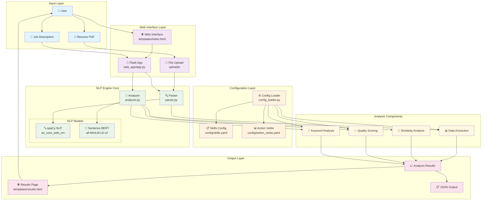
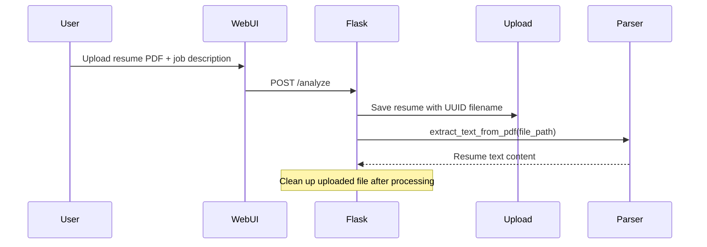
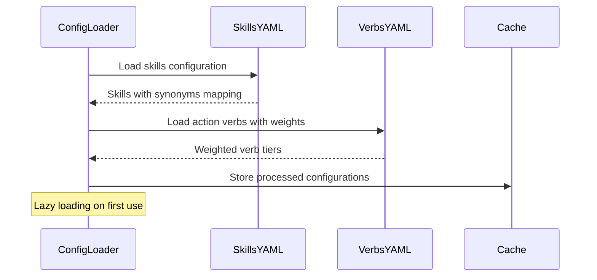
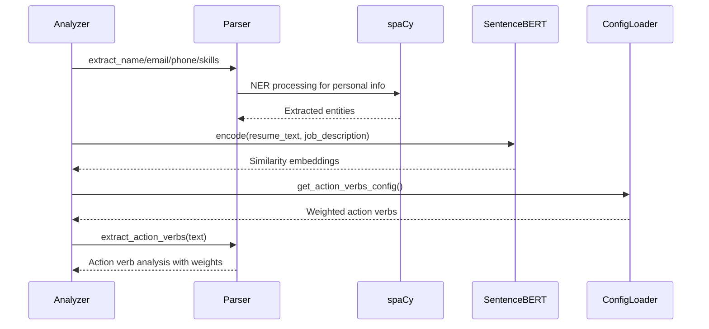
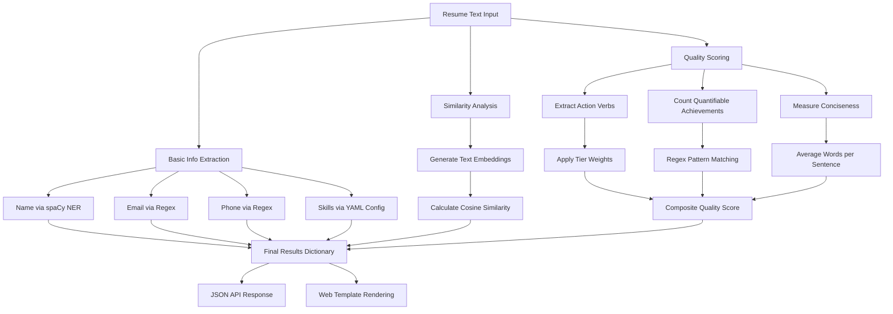

# NLP Resume Analyzer - Data Flow Diagram

## Overview
This document describes the data flow architecture of the NLP Resume Analyzer system, showing how data moves through different components from input to final analysis results.

## System Architecture Data Flow



## Detailed Data Flow Process

### 1. Input Processing Flow


### 2. Configuration Loading Flow


### 3. NLP Analysis Flow


### 4. Scoring and Analysis Flow


## Data Structures and Flow

### Input Data Structure
```
User Input:
├── Resume File (PDF)
├── Job Description (Text)
└── Analysis Request

File Processing:
├── UUID Generation for uploaded file
├── PDF Text Extraction (PyMuPDF)
├── Temporary File Storage
└── Cleanup after processing
```

### Configuration Data Flow
```
YAML Configs:
├── skills.yaml
│   ├── Categories (programming_languages, web_frameworks, etc.)
│   ├── Primary Skills
│   └── Synonyms Mapping
└── action_verbs.yaml
    ├── Tier Classification (impact, achievement, technical, basic)
    ├── Weight Assignment (3.0, 2.0, 1.5, 1.0)
    └── Verb Lists per Tier

Processing:
├── Lazy Loading on First Use
├── Caching for Performance
├── Synonym Resolution
└── Weight Application
```

### Analysis Pipeline Data Flow
```
Text Processing:
├── spaCy Pipeline
│   ├── Tokenization
│   ├── Named Entity Recognition
│   ├── Part-of-Speech Tagging
│   └── Sentence Segmentation
├── Sentence Transformers
│   ├── Text Embedding Generation
│   ├── Similarity Computation
│   └── Cosine Score Calculation
└── Regex Pattern Matching
    ├── Email Detection
    ├── Phone Number Detection
    └── Quantifiable Achievement Detection

Scoring Components:
├── Action Verb Scoring (60% weight)
│   ├── Tier-based Weight Application
│   ├── Frequency Analysis
│   └── Line-normalized Scoring
├── Quantifiable Achievements (25% weight)
│   ├── Number Pattern Detection
│   ├── Percentage Identification
│   └── Currency Amount Detection
└── Conciseness Scoring (15% weight)
    ├── Average Words per Sentence
    ├── Sentence Length Analysis
    └── Brevity Assessment
```

### Output Data Structure
```
Analysis Results:
├── Basic Information
│   ├── name: String
│   ├── email: String
│   ├── phone: String
│   └── skills: List[String]
├── Similarity Analysis
│   └── similarity_score: Float (0-1)
├── Quality Analysis
│   ├── overall_score: Float (0-100)
│   ├── action_verb_analysis: Dict
│   ├── quantifiable_score: Float
│   ├── conciseness_score: Float
│   └── breakdown: Dict
├── Keyword Analysis
│   ├── matched_keywords: List[String]
│   └── missing_keywords: List[String]
└── Presentation
    ├── JSON API Response
    └── HTML Template Rendering
```

## Performance Considerations

### Model Loading Strategy
- **Lazy Loading**: NLP models loaded only when first needed
- **Singleton Pattern**: Models cached after first load
- **Memory Management**: Efficient model reuse across requests

### File Processing Optimization
- **Temporary Storage**: UUID-based filename collision avoidance
- **Immediate Cleanup**: Files deleted after processing
- **Error Handling**: Graceful failure with cleanup

### Configuration Caching
- **One-time Load**: YAML configs loaded and cached
- **Synonym Preprocessing**: Efficient lookup structures
- **Weight Normalization**: Pre-calculated scoring weights

This data flow diagram provides a comprehensive view of how data moves through the NLP Resume Analyzer system, from user input through processing to final results presentation.